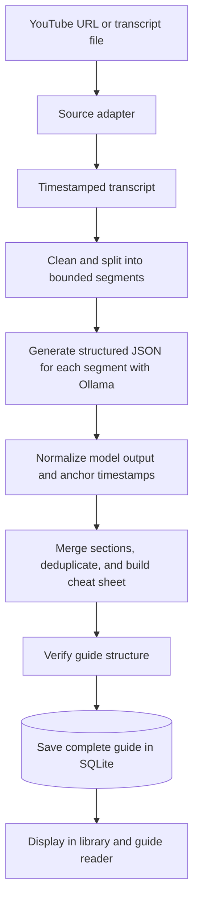

# tutorio

Tutorio is a local-first desktop application that reconstructs long-form tutorials as practical learning manuals. It is intentionally **not a summariser**: generated guides preserve procedures, explanations, commands, warnings, mistakes, shortcuts, and source timestamps.

Everything runs on the user's machine. There are no cloud services, accounts, or authentication.

## Current foundation

This repository provides a buildable Wails application and the architectural spine for the MVP:

- YouTube subtitle retrieval through `yt-dlp`.
- local `.txt`, `.srt`, and `.vtt` transcript ingestion.
- transcript cleaning and cue-aware segmentation.
- structured JSON generation through a local Ollama model.
- structural verification before persistence.
- a single-worker background compilation queue with cancellation and automatic restart recovery.
- persistent per-section results with targeted retry after interruption.
- verified transcript excerpts and clickable source timestamps.
- guide editing, single-section regeneration, and Markdown export.
- SQLite storage and a Wails guide library/reader.

The UI is deliberately small. Model setup and native transcript-file selection remain in the usable-MVP phase described in [the roadmap](docs/ROADMAP.md).

## Architecture

Dependency direction points inward. Domain and orchestration packages do not import Wails, SQLite, Ollama, or process-execution details.

```text
Wails UI ─> jobs.Manager ─> jobs.Pipeline ─> source / transcript / guide interfaces
yt-dlp ───┤                         ▲            ▲
Ollama ───┤                         │            │
SQLite ───┘                    domain models  use-case rules
```

### How compilation works



1. The UI persists a pending job and returns immediately; a single background worker runs queued jobs without competing Ollama requests.
2. The source registry selects the YouTube or local-file adapter.
3. `yt-dlp` retrieves YouTube subtitles; TXT, SRT, and VTT files are parsed directly.
4. Transcript text is cleaned while source timestamps are preserved.
5. Oversized transcripts and cues are divided into model-sized segments.
6. Ollama reconstructs each segment as structured guide content; live progress is sent to Wails.
7. Model variations are normalized, timestamps are anchored to the original timeline, and segment guides are merged.
8. Each completed section and its performance metadata are persisted so failed work can resume without repeating successful sections.
9. The result is verified, stored as structured JSON in SQLite, and loaded by the library reader after restart.

Package responsibilities:

| Package | Responsibility |
| --- | --- |
| repository `main.go` | Wails-required composition root and lifecycle |
| `cmd/app` | Desktop frontend assets (kept under the conventional app shell) |
| `internal/source` | Source contract and adapter registry |
| `internal/source/youtube` | `yt-dlp` process adapter |
| `internal/source/local` | Local transcript-file adapter |
| `internal/transcript` | Source-neutral parsing, cleaning, segmentation |
| `internal/llm` | Model-provider contract and Ollama HTTP adapter |
| `internal/guide` | Guide domain, generation and verification contracts |
| `internal/jobs` | Background queue, pipeline use case, recovery, and stage orchestration |
| `internal/storage/sqlite` | SQLite connection, schema, guide repository |
| `internal/config` | YAML configuration and local defaults |
| `internal/ui` | Thin Wails-facing application API |
| `internal/exporter` | Output contract and Markdown implementation |

Interfaces are owned near the code that consumes their behavior and kept small. `context.Context` crosses every operation that can block. Dependencies are assembled only in the root `main.go`; no package-level mutable state is used. Wails v2's binding generator requires its Go entrypoint at the project root, so this is the one intentional variation from the usual `cmd/app/main.go` layout.

### Extension strategy

New content sources implement `source.Source` and register at startup. Whisper can become another source/transcription adapter; screenshots can be introduced as an optional enrichment stage; vision models can implement a provider boundary parallel to `llm.Provider`. Exporters and learning-artifact generators should be independent use cases over persisted `guide.Guide` values. Playlist support should compose child jobs rather than enlarge the YouTube adapter.

This keeps future media capabilities out of the text-only MVP while leaving clear seams for them.

## Guide model

The stored guide includes overview, prerequisites, final outcome, ordered steps, transcript evidence, important concepts, commands, keyboard shortcuts, warnings, common mistakes, cheat sheet, appendix, source timestamps, and generation metadata. SQLite stores searchable identity/summary columns plus the complete versionable guide as validated JSON. Jobs and individual transcript/model sections are persisted separately for recovery and targeted regeneration. The schema is in [`internal/storage/sqlite/schema.sql`](internal/storage/sqlite/schema.sql).

For production evolution, add numbered embedded migrations rather than editing an already-released migration.

## Prerequisites

- Go 1.25 or newer.
- Wails v2 and its platform prerequisites.
- Node.js/npm for the Vite frontend.
- `yt-dlp` on `PATH` for YouTube sources.
- Ollama running locally with the configured model, initially `qwen3:8b`.

For example:

```sh
ollama pull qwen3:8b
ollama serve
```

Tutorio invokes tools locally and sends model requests only to the configured Ollama URL.

## Configuration

Tutorio resolves configuration in this order:

1. The path in `TUTORIO_CONFIG_PATH`, when set.
2. `config.yaml` in the current working directory (convenient for `wails dev`).
3. The OS user config directory (`tutorio/config.yaml`).

If none exists, local defaults are used. Copy `config.example.yaml` to `config.yaml` for development. The startup log reports the selected path and Ollama model. The default database is placed under the OS user config directory unless `database.path` overrides it.

```yaml
database:
  path: ./data/tutorio.db
ollama:
  base_url: http://127.0.0.1:11434
  model: qwen3:8b
  max_output_tokens: 8192
  context_window: 32768
tools:
  yt_dlp_path: yt-dlp
processing:
  segment_characters: 12000
```

`segment_characters` is a conservative character budget, not a tokenizer. A later model-aware segmenter can replace it without changing the pipeline.

### Choosing an Ollama model

There is no universal best model: tutorial reconstruction trades generation time, completeness, concision, schema reliability, and local memory use.

| Model | Expected fit for tutorio |
| --- | --- |
| `gemma4:e4b` | Recommended quality baseline when concise, tightly scoped guide sections matter more than generation speed. In initial testing it was slower but less verbose. |
| `qwen3.5:9b` | Useful detail-oriented alternative. Initial testing extracted more material, but sometimes produced overly verbose or unnecessary content. |
| `qwen3.5:4b` | A useful newer, smaller Qwen competitor for speed/quality experiments against Gemma 4 E4B. It has not yet been validated by this project. |
| `qwen3:8b` | Older text-only Qwen 3 baseline. The tag means “Qwen 3, 8B parameters”; it is not a Qwen 3.8 release and does not supersede Qwen 3.5. |

Keep `max_output_tokens`, `context_window`, segmentation, source URL, and prompt settings identical when comparing models. Compare total duration, step usefulness, timestamp accuracy, shortcut/command extraction, schema reliability, and unnecessary repetition—not output length alone.

## Development

Install dependencies and run tests:

```sh
go mod tidy
go test ./...
```

Run the desktop app with live frontend reload:

```sh
wails dev
```

Build the production desktop bundle:

```sh
wails build
```

Useful equivalents are available through `make test`, `make dev`, and `make build`.

When adding a feature, put domain data/rules in an inner package, define the smallest needed interface, implement infrastructure in an adapter package, and wire it at the composition root. Use fakes at the interface boundary in unit tests. External-process and HTTP adapters should additionally have fixture-driven contract tests.

Run the opt-in local integration test against a real URL and the configured Ollama model with:

```sh
TUTORIO_CONFIG_PATH="$PWD/config.yaml" \
TUTORIO_TEST_URL="https://www.youtube.com/watch?v=VIDEO_ID" \
go test -tags=integration ./internal/integration -run TestCompileYouTube -v -count=1 -timeout=20m
```

The test uses a temporary SQLite database and does not add its output to the desktop library.

## Deliberate limitations

- Long transcripts are generated section-by-section and merged deterministically. A later synthesis pass may improve cross-section narrative cohesion without sacrificing provenance.
- Verification checks structure, not yet factual grounding against transcript evidence.
- The queue deliberately runs one compilation at a time to avoid concurrent local-model memory pressure.
- The backend supports transcript-file import, while native file selection and its frontend control are Phase 1 UI work.
- Audio transcription, screenshots, vision, playlists, PDF export, flashcards, quizzes, and progressive learning are architecture extension points only.

See [docs/ROADMAP.md](docs/ROADMAP.md) for phased delivery criteria.
